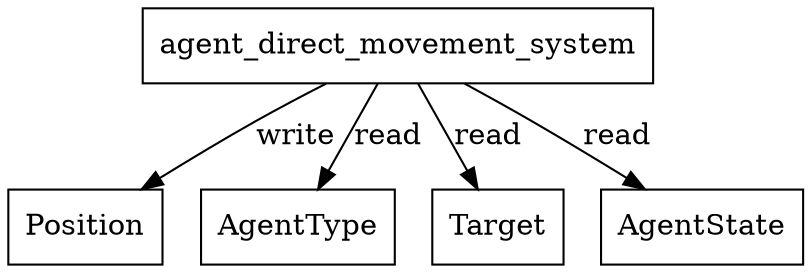

# agent_direct_movement_system Calls Audit

## System Definition
**File:** `src/ecs/systems/agent.rs`

```rust
/// Moves agent directly toward target if no path is present.
pub fn agent_direct_movement_system() -> impl legion::systems::Runnable {
    legion::SystemBuilder::new("AgentDirectMovementSystem")
        .with_query(<(&mut Position, &AgentType, &mut Target, &mut AgentState)>::query())
        .build(|_, world, _, query| {
            for (pos, agent_type, target, agent_state) in query.iter_mut(world) {
                if *agent_state == AgentState::Idle || *agent_state == AgentState::Moving {
                    let dist = ((target.x - pos.x).powi(2) + (target.y - pos.y).powi(2)).sqrt();
                    let step = agent_type.movement_profile.speed.min(dist);
                    if dist > 0.1 {
                        pos.x += (target.x - pos.x) / dist * step;
                        pos.y += (target.y - pos.y) / dist * step;
                    } else {
                        pos.x = target.x;
                        pos.y = target.y;
                        // State transition handled elsewhere
                    }
                }
            }
        })
}
```

## Dependencies & Resource Access
- **Reads:**
  - `AgentType` (read)
  - `Target` (read)
  - `AgentState` (read)
- **Writes:**
  - `Position` (mutates x/y)
- **Entity:** Not used
- **No explicit resource reads/writes**
- **No cross-system calls**

## Access Pattern
- Iterates all agents with `Position`, `AgentType`, `Target`, `AgentState`.
- If in Idle/Moving state, moves agent directly toward target.
- If close to target, snaps agent to target position.
- No logging or side effects.

## Potential Conflicts
- **Write conflict:** Any other system writing to `Position` in the same schedule phase could cause a Legion access error.
- **Safe if scheduled alone or with only readers of `Position`**

## Graphviz Representation



---

**Summary:**
- This system moves agents directly toward their target if no path is present.
- No resource or system dependencies beyond the listed components.
- Schedule with care to avoid concurrent writes to `Position`.
