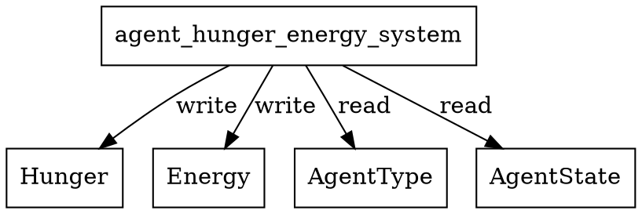

# agent_hunger_energy_system Calls Audit

## System Definition
**File:** `src/ecs/systems/agent.rs`

```rust
/// ECS Agent Hunger/Energy System
pub fn agent_hunger_energy_system() -> impl legion::systems::Runnable {
    legion::SystemBuilder::new("AgentHungerEnergySystem")
        .with_query(<(Entity, &AgentType, &mut crate::agent::Hunger, &mut crate::agent::Energy, &AgentState)>::query())
        .build(|_, world, _, query| {
            for (_entity, agent_type, hunger, energy, agent_state) in query.iter_mut(world) {
                // Hunger logic (mirrors previous passive_hunger_system)
                if *agent_state == AgentState::Idle || *agent_state == AgentState::Arrived {
                    hunger.value -= agent_type.hunger_rate * 0.1;
                    energy.value -= 0.1; // slow energy drain when idle/arrived
                } else if *agent_state == AgentState::Moving {
                    hunger.value -= agent_type.hunger_rate;
                    energy.value -= 1.0; // faster energy drain when moving
                }
            }
        })
}
```

## Dependencies & Resource Access
- **Reads:**
  - `AgentType` (read)
  - `AgentState` (read)
- **Writes:**
  - `Hunger` (mutates value)
  - `Energy` (mutates value)
- **Entity:** Used for iteration only
- **No explicit resource reads/writes**
- **No cross-system calls**

## Access Pattern
- Iterates all agents with `AgentType`, `Hunger`, `Energy`, and `AgentState`.
- Applies different hunger/energy drain rates based on agent state.
- No logging or side effects.

## Potential Conflicts
- **Write conflict:** Any other system writing to `Hunger` or `Energy` in the same schedule phase could cause a Legion access error.
- **Safe if scheduled alone or with only readers of `Hunger`/`Energy`**

## Graphviz Representation



---

**Summary:**
- This system manages passive hunger and energy drain for all agents.
- No resource or system dependencies beyond the listed components.
- Schedule with care to avoid concurrent writes to `Hunger` or `Energy`.
