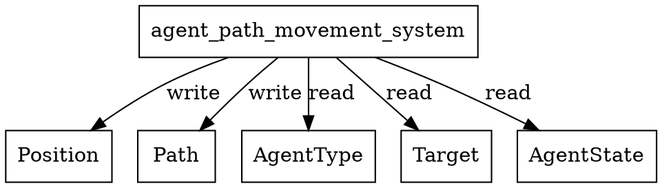

# agent_path_movement_system Calls Audit

## System Definition
**File:** `src/ecs/systems/agent.rs`

```rust
/// Moves agent along waypoints if Path is present and not empty.
pub fn agent_path_movement_system() -> impl legion::systems::Runnable {
    legion::SystemBuilder::new("AgentPathMovementSystem")
        .with_query(<(&mut Position, &AgentType, &mut Path, &mut Target, &mut AgentState)>::query())
        .build(|_, world, _, query| {
            for (pos, agent_type, path, maybe_target, agent_state) in query.iter_mut(world) {
                if *agent_state == AgentState::Idle || *agent_state == AgentState::Moving {
                    if !path.waypoints.is_empty() {
                        let (tx, ty) = path.waypoints[0];
                        let dx = tx as f32 - pos.x;
                        let dy = ty as f32 - pos.y;
                        let dist = (dx * dx + dy * dy).sqrt();
                        let step = agent_type.movement_profile.speed.min(dist);
                        pos.x += dx / dist * step;
                        pos.y += dy / dist * step;
                        path.waypoints.pop_front();
                    } else {
                        pos.x = maybe_target.x;
                        pos.y = maybe_target.y;
                        // State transition handled elsewhere
                    }
                }
            }
        })
}
```

## Dependencies & Resource Access
- **Reads:**
  - `AgentType` (read)
  - `Target` (read)
  - `AgentState` (read)
- **Writes:**
  - `Position` (mutates x/y)
  - `Path` (mutates waypoints)
- **Entity:** Not used
- **No explicit resource reads/writes**
- **No cross-system calls**

## Access Pattern
- Iterates all agents with `Position`, `AgentType`, `Path`, `Target`, `AgentState`.
- If in Idle/Moving state and path is not empty, moves agent along path.
- If path is empty, snaps agent to target position.
- No logging or side effects.

## Potential Conflicts
- **Write conflict:** Any other system writing to `Position` or `Path` in the same schedule phase could cause a Legion access error.
- **Safe if scheduled alone or with only readers of `Position`/`Path`**

## Graphviz Representation



---

**Summary:**
- This system moves agents along their path if waypoints exist, otherwise snaps to target.
- No resource or system dependencies beyond the listed components.
- Schedule with care to avoid concurrent writes to `Position` or `Path`.
