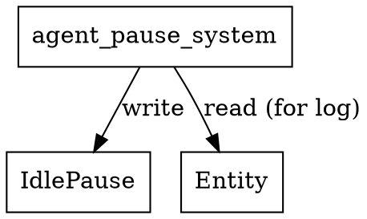

# [REMOVED] agent_pause_system Calls Audit

This system has been removed from the codebase as of 2025-04-26. See audit logs for details. The recommended replacement is `agent_pausing_system` in `src/ecs/systems/agent.rs`.

## System Definition
**File:** `src/agent/pause_system.rs`

```rust
/// System to decrement IdlePause for all agents and log when unpaused.
pub fn agent_pause_system() -> impl legion::systems::Runnable {
    SystemBuilder::new("AgentPauseSystem")
        .with_query(<(Entity, &mut IdlePause)>::query())
        .build(|_, world, _, query| {
            for (entity, idle_pause) in query.iter_mut(world) {
                log::debug!("[PAUSE] Agent {:?} ticks_remaining: {}", entity, idle_pause.ticks_remaining);
                if idle_pause.ticks_remaining > 0 {
                    idle_pause.ticks_remaining -= 1;
                    log::debug!("[PAUSE] Agent {:?} decremented to {}", entity, idle_pause.ticks_remaining);
                    if idle_pause.ticks_remaining == 0 {
                        log::debug!("[PAUSE] Agent {:?} is now unpaused", entity);
                    }
                }
            }
        })
}
```

## Dependencies & Resource Access
- **Reads/Writes:**
  - **Component:** `IdlePause` (mutable)
  - **Entity:** for logging purposes
- **No explicit resource reads/writes** (only works with components in the world)
- **No cross-system calls**
- **No external resources or side effects except logging**

## Access Pattern
- Iterates over all entities with `IdlePause`
- Decrements `ticks_remaining` if greater than zero
- Logs state changes for debugging

## Potential Conflicts
- **Write conflict**: Any other system writing to `IdlePause` in the same schedule phase could cause a Legion access error.
- **Safe if scheduled alone or with only readers of `IdlePause`**

## Graphviz Representation



---

**Summary:**
- This system is minimal and focused: only decrements and logs `IdlePause`.
- No resource or system dependencies beyond the `IdlePause` component.
- Schedule with care to avoid concurrent writes to `IdlePause`.
