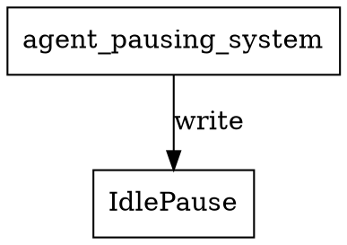

# agent_pausing_system Calls Audit

## System Definition
**File:** `src/ecs/systems/agent.rs`

```rust
/// Agent pausing system: handles all IdlePause logic (decrementing ticks_remaining).
pub fn agent_pausing_system() -> impl legion::systems::Runnable {
    legion::SystemBuilder::new("AgentPausingSystem")
        .with_query(<(Entity, &mut crate::agent::components::IdlePause)>::query())
        .build(|_, world, _, query| {
            for (_entity, idle_pause) in query.iter_mut(world) {
                if idle_pause.ticks_remaining > 0 {
                    idle_pause.ticks_remaining -= 1;
                }
            }
        })
}
```

## Dependencies & Resource Access
- **Reads/Writes:**
  - **Component:** `IdlePause` (mutable)
  - **Entity:** (not used except for iteration)
- **No explicit resource reads/writes**
- **No cross-system calls**
- **No external resources or side effects**

## Access Pattern
- Iterates over all entities with `IdlePause`
- Decrements `ticks_remaining` if greater than zero
- Does not log or interact with other components/resources

## Potential Conflicts
- **Write conflict:** Any other system writing to `IdlePause` in the same schedule phase could cause a Legion access error.
- **Safe if scheduled alone or with only readers of `IdlePause`**

## Graphviz Representation



---

**Summary:**
- This system is minimal and focused: only decrements `IdlePause`.
- No resource or system dependencies beyond the `IdlePause` component.
- Schedule with care to avoid concurrent writes to `IdlePause`.
