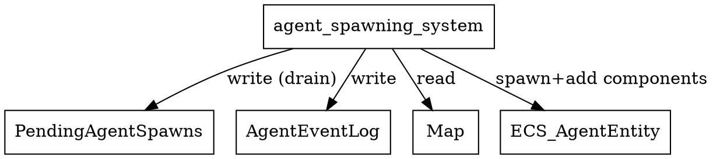

# agent_spawning_system Calls Audit

## System Definition
**File:** `src/ecs/systems/agent_spawn.rs`

```rust
// ECS System: agent_spawning_system
// Consumes PendingAgentSpawns and creates new agent entities in the ECS world.
pub fn agent_spawning_system() -> impl Runnable {
    SystemBuilder::new("AgentSpawningSystem")
        .write_resource::<PendingAgentSpawns>()
        .write_resource::<AgentEventLog>()
        .read_resource::<Map>()
        .build(|cmd, world, (pending_spawns, agent_event_log, map), _| {
            let mut to_spawn = Vec::new();
            let mut tick_spawn_count = 0;
            while let Some(request) = pending_spawns.pop() {
                log::debug!("[DEBUG][AgentSpawningSystem] Popped AgentSpawnRequest: pos=({}, {}), type={}", request.pos.x, request.pos.y, request.agent_type.name);
                to_spawn.push(request);
            }
            log::debug!("[DEBUG][AgentSpawningSystem] Total AgentSpawnRequests to spawn this tick: {}", to_spawn.len());
            if to_spawn.is_empty() {
                log::warn!("[DEBUG][AgentSpawningSystem] No AgentSpawnRequests to process this tick!");
            }
            for AgentSpawnRequest { pos, agent_type } in to_spawn {
                let mut rng = rand::thread_rng();
                let swim_chance_percent = rand::Rng::gen_range(&mut rng, 1..=30);
                let swimming_profile = SwimmingProfile {
                    swim_chance_percent,
                    swim_ticks_remaining: 0,
                };
                let hunger_threshold = agent_type.hunger_threshold;
                let entity = cmd.push((pos, agent_type.clone(), Hunger { value: 100.0, threshold: hunger_threshold }, Energy { value: 100.0 }, AgentState::Idle));
                log::debug!("[DEBUG][AgentSpawningSystem] Spawned agent entity {:?} at ({}, {}) of type {}", entity, pos.x, pos.y, agent_type.name);
                tick_spawn_count += 1;
                cmd.add_component(entity, IdlePause::default());
                cmd.add_component(entity, swimming_profile);
                cmd.add_component(entity, InteractionState::default());
                cmd.add_component(entity, MovementHistory::new(12));
                cmd.add_component(entity, Path::default());
                cmd.add_component(entity, Target::default());
                agent_event_log.push(AgentEvent::Spawned {
                    agent: entity,
                    agent_type: agent_type.name.clone(),
                    pos: (pos.x, pos.y),
                });
            }
            let agent_count = <(&crate::ecs_components::Position,)>::query().iter(world).count();
            log::info!("[DEBUG][AgentSpawningSystem] Number of agents in world after spawn: {} (spawned this tick: {})", agent_count, tick_spawn_count);
        })
}
```

## Dependencies & Resource Access
- **Writes:**
  - `PendingAgentSpawns` (resource, drained)
  - `AgentEventLog` (resource, records spawn events)
- **Reads:**
  - `Map` (resource, for spawn context)
- **Entity creation:**
  - Spawns new agent entities with multiple components (Position, AgentType, Hunger, Energy, AgentState, etc.)
  - Adds additional components: IdlePause, SwimmingProfile, InteractionState, MovementHistory, Path, Target

## Access Pattern
- Drains `PendingAgentSpawns` for all queued spawn requests.
- For each request, creates a new agent entity and attaches all required components.
- Records each spawn in the `AgentEventLog`.
- Logs the number of agents spawned and total agents in the world after spawning.

## Potential Conflicts
- **Write conflict:** Any other system writing to `PendingAgentSpawns` or `AgentEventLog` in the same phase could cause a Legion access error.
- **Safe if scheduled alone or with only readers of these resources.**
- **Not a likely source of ECS borrow panics** (unless resource writes overlap with other systems).

## Graphviz Representation



---

**Summary:**
- This system is responsible for creating new agent entities in the ECS world from queued spawn requests.
- It is safe as long as no other system writes to `PendingAgentSpawns` or `AgentEventLog` in the same phase.
- Not a likely source of ECS borrow panics, but resource write conflicts should be avoided.
