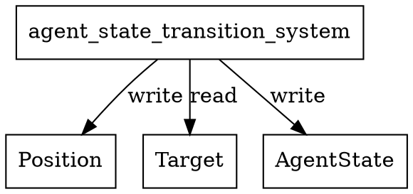

# agent_state_transition_system Calls Audit

## System Definition
**File:** `src/ecs/systems/agent.rs`

```rust
/// Agent state transition system: sets AgentState::Arrived when agent position matches target.
pub fn agent_state_transition_system() -> impl legion::systems::Runnable {
    legion::SystemBuilder::new("AgentStateTransitionSystem")
        .with_query(<(&mut Position, &Target, &mut AgentState)>::query())
        .build(|_, world, _, query| {
            for (pos, target, agent_state) in query.iter_mut(world) {
                if *agent_state == AgentState::Moving || *agent_state == AgentState::Idle {
                    let dist = ((target.x - pos.x).powi(2) + (target.y - pos.y).powi(2)).sqrt();
                    if dist <= 0.1 {
                        *agent_state = AgentState::Arrived;
                    }
                }
            }
        })
}
```

## Dependencies & Resource Access
- **Reads:**
  - `Target` (read)
  - `AgentState` (read, but also mutates)
- **Writes:**
  - `Position` (mutates x/y)
  - `AgentState` (sets to Arrived)
- **Entity:** Not used
- **No explicit resource reads/writes**
- **No cross-system calls**

## Access Pattern
- Iterates all agents with `Position`, `Target`, `AgentState`.
- If in Moving/Idle state and within threshold of target, sets state to Arrived.
- No logging or side effects.

## Potential Conflicts
- **Write conflict:** Any other system writing to `AgentState` or `Position` in the same schedule phase could cause a Legion access error.
- **Safe if scheduled alone or with only readers of `AgentState`/`Position`**

## Graphviz Representation



---

**Summary:**
- This system sets agents to Arrived if they are close enough to their target.
- No resource or system dependencies beyond the listed components.
- Schedule with care to avoid concurrent writes to `AgentState` or `Position`.
