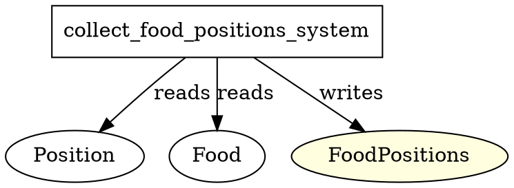

# System: collect_food_positions_system

**Location:** `src/food/systems.rs`

---

## Function Definition
```rust
pub fn collect_food_positions_system() -> impl systems::Runnable {
    SystemBuilder::new("CollectFoodPositionsSystem")
        .write_resource::<FoodPositions>()
        .with_query(<(&Position, &Food)>::query())
        .build(|_, world, food_positions, query| {
            let mut positions = Vec::new();
            for (pos, _food) in query.iter(world) {
                positions.push((pos.x, pos.y));
            }
            food_positions.0 = positions;
        })
}
```

---

## Calls / Dependencies
- **Direct function calls:** None (just uses a for-loop and basic Vec operations)
- **Indirect dependencies:**
  - `Position` and `Food` components (queried)
  - `FoodPositions` resource (written)

---

## ECS Access Pattern
- **Reads:**
  - `Position` (component)
  - `Food` (component)
- **Writes:**
  - `FoodPositions` (resource)

---

## Summary
- This system is minimal and focused.
- It collects all food entity positions and writes them into the `FoodPositions` resource.
- **No nested system/function calls.**
- **No direct resource conflict risk** (unless another system writes to `FoodPositions` in the same schedule stage).

---

## Graphviz (DOT) Representation


---

## Notes
- **Conflict risk:** Only if another system writes to `FoodPositions` in the same schedule stage.
- **Recommendation:** Keep this system isolated or flush after it (which is already done).
