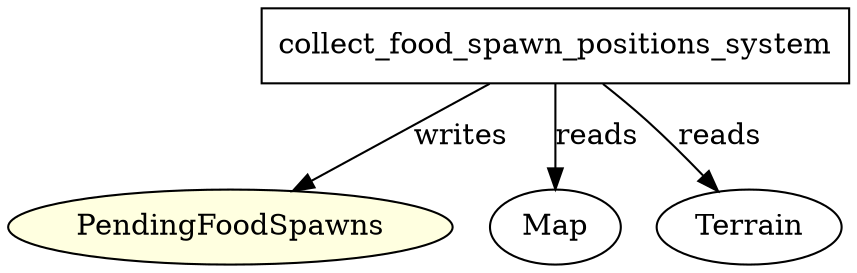

# System: collect_food_spawn_positions_system

**Location:** `src/food/systems.rs`

---

## Function Definition
```rust
pub fn collect_food_spawn_positions_system() -> impl systems::Runnable {
    SystemBuilder::new("CollectFoodSpawnPositionsSystem")
        .write_resource::<PendingFoodSpawns>()
        .read_resource::<crate::map::Map>()
        .build(|_, _world, (pending_food, map), _| {
            let num_to_spawn = (map.width * map.height / 20000).max(2);
            let mut rng = rand::thread_rng();
            let mut positions_to_spawn = Vec::new();
            for _ in 0..num_to_spawn {
                let mut x;
                let mut y;
                let mut tries = 0;
                loop {
                    x = rng.gen_range(0..map.width) as f32;
                    y = rng.gen_range(0..map.height) as f32;
                    if map.tiles[y as usize][x as usize] == crate::map::Terrain::Grass || map.tiles[y as usize][x as usize] == crate::map::Terrain::Forest {
                        break;
                    }
                    tries += 1;
                    if tries > 1000 {
                        break;
                    }
                }
                positions_to_spawn.push((x, y));
            }
            pending_food.0 = positions_to_spawn.into();
        })
}
```

---

## Calls / Dependencies
- **Direct function calls:** None (uses standard Vec/rng operations)
- **Indirect dependencies:**
  - `PendingFoodSpawns` resource (written)
  - `Map` resource (read)
  - `Terrain` enum (read via `map.tiles`)

---

## ECS Access Pattern
- **Reads:**
  - `Map` (resource)
  - `Terrain` (enum, via map.tiles)
- **Writes:**
  - `PendingFoodSpawns` (resource)

---

## Summary
- This system is minimal and focused.
- It determines valid positions for spawning food and writes them to the `PendingFoodSpawns` resource.
- **No nested system/function calls.**
- **No direct resource conflict risk** (unless another system writes to `PendingFoodSpawns` in the same schedule stage).

---

## Graphviz (DOT) Representation


---

## Notes
- **Conflict risk:** Only if another system writes to `PendingFoodSpawns` in the same schedule stage.
- **Recommendation:** Keep this system isolated or flush after it (which is already done).
