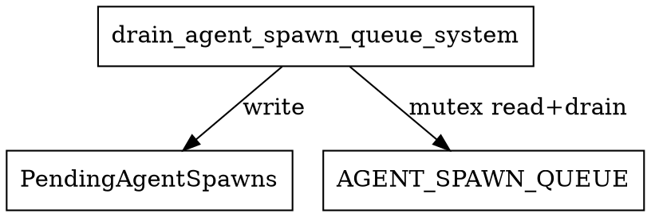

# drain_agent_spawn_queue_system Calls Audit

## System Definition
**File:** `src/ecs/systems/drain_agent_spawn_queue.rs`

```rust
/// ECS system: Drains the global agent spawn queue into the ECS PendingAgentSpawns resource.
pub fn drain_agent_spawn_queue_system() -> impl legion::systems::Runnable {
    SystemBuilder::new("DrainAgentSpawnQueueSystem")
        .write_resource::<PendingAgentSpawns>()
        .build(|_, _world, pending_spawns, _| {
            let mut queue = AGENT_SPAWN_QUEUE.lock().unwrap();
            for req in queue.drain(..) {
                pending_spawns.add(req.pos, req.agent_type);
            }
        })
}
```

## Dependencies & Resource Access
- **Writes:**
  - `PendingAgentSpawns` (as a Legion resource)
- **Reads:**
  - `AGENT_SPAWN_QUEUE` (global static, mutex-guarded)
- **No entity queries**
- **No cross-system calls**

## Access Pattern
- Locks and drains the global agent spawn queue (mutex-protected).
- Adds drained spawn requests to the `PendingAgentSpawns` ECS resource.
- No ECS entity/component queries.

## Potential Conflicts
- **Write conflict:** Any other system writing to `PendingAgentSpawns` in the same schedule phase could cause a Legion access error.
- **Safe if scheduled alone or with only readers of `PendingAgentSpawns`**
- **Thread safety:** Relies on mutex for global queue access, so not a source of ECS borrow panics.

## Graphviz Representation



---

**Summary:**
- This system bridges the global agent spawn queue and the ECS world.
- It is safe as long as no other system writes to `PendingAgentSpawns` in the same phase.
- Not a likely source of ECS borrow panics.
