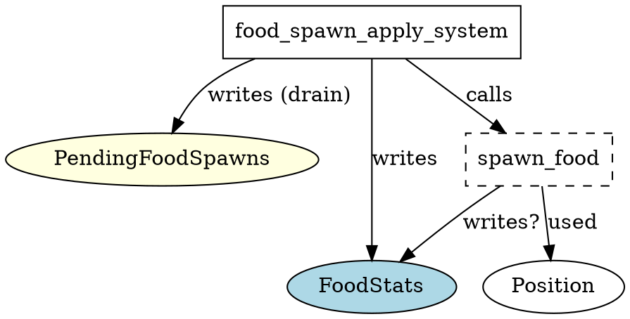

# System: food_spawn_apply_system

**Location:** `src/food/systems.rs`

---

## Function Definition
```rust
pub fn food_spawn_apply_system() -> impl systems::Runnable {
    SystemBuilder::new("FoodSpawnApplySystem")
        .write_resource::<PendingFoodSpawns>()
        .write_resource::<FoodStats>()
        .build(|cmd, _world, (pending, food_stats), _| {
            for (x, y) in pending.0.drain(..) {
                let pos = Position { x, y };
                let stats_opt = Some(&mut **food_stats);
                crate::ecs_components::spawn_food(cmd, pos, stats_opt);
            }
        })
}
```

---

## Calls / Dependencies
- **Direct function calls:**
  - `crate::ecs_components::spawn_food(cmd, pos, stats_opt)`
- **Indirect dependencies:**
  - `PendingFoodSpawns` resource (written)
  - `FoodStats` resource (written)
  - `Position` struct
  - `spawn_food` (function)

---

## ECS Access Pattern
- **Reads:**
  - None (does not explicitly read any resource, but consumes PendingFoodSpawns)
- **Writes:**
  - `PendingFoodSpawns` (resource, drained/emptied)
  - `FoodStats` (resource, passed as mutable reference to spawn_food)

---

## Summary
- This system spawns food entities at positions queued in `PendingFoodSpawns` and updates `FoodStats`.
- It **drains** the `PendingFoodSpawns` queue (empties it each tick).
- Calls `spawn_food`, which may have additional side effects (see below).
- **Potential conflict:** If another system writes to `PendingFoodSpawns` or `FoodStats` in the same schedule stage.

---

## Graphviz (DOT) Representation


---

## Notes
- **Conflict risk:** If other systems write to `PendingFoodSpawns` or `FoodStats` in the same stage.
- **Recommendation:** Keep this system isolated or flush after it (which is already done).
- **TODO:** Audit `spawn_food` for further resource/component access.
