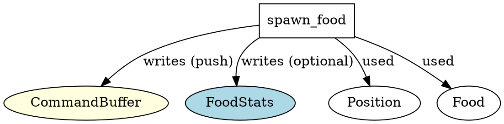

# Function: spawn_food

**Location:** `src/ecs_components.rs`

---

## Function Definition
```rust
pub fn spawn_food(cmd: &mut CommandBuffer, pos: Position, food_stats: Option<&mut FoodStats>) -> legion::Entity {
    let nutrition = rand::thread_rng().gen_range(5.0..=10.0);
    if let Some(stats) = food_stats {
        stats.spawned_per_tick += 1;
    }
    cmd.push((pos, Food { nutrition }))
}
```

---

## Calls / Dependencies
- **Direct function calls:**
  - `rand::thread_rng().gen_range(5.0..=10.0)`
  - `cmd.push((pos, Food { nutrition }))`
- **Indirect dependencies:**
  - `CommandBuffer` (mutably borrows for entity creation)
  - `FoodStats` (mutably, if provided)
  - `Position` (component)
  - `Food` (component)

---

## ECS Access Pattern
- **Reads:**
  - None (does not read any ECS resource/component directly)
- **Writes:**
  - `FoodStats` (optional, increments `spawned_per_tick`)
  - ECS world (via `cmd.push`, creates a new entity with `Position` and `Food` components)

---

## Summary
- This function spawns a new food entity at the specified position with random nutrition (5.0–10.0).
- If `food_stats` is provided, increments `spawned_per_tick`.
- Returns the created entity.
- **No nested ECS queries or reads.**
- **No direct resource conflict risk** unless `FoodStats` is mutably accessed elsewhere concurrently.

---

## Graphviz (DOT) Representation


---

## Notes
- **Conflict risk:** Only if another function mutably accesses `FoodStats` at the same time.
- **Recommendation:** Safe to use as long as `FoodStats` is not mutably borrowed elsewhere in the same schedule stage.
