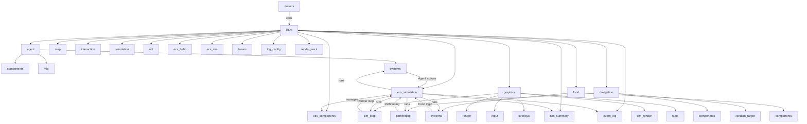

# High-Level Project Structure (Text)

Top-Level Modules:
- agent: Agent components, systems, and neural net logic (MLP)
- map: Map structure and logic
- interaction: Handles agent interactions
- simulation: Core simulation logic (legacy and ECS)
- graphics: Rendering, input, overlays, and simulation loop
- util: Utility functions
- ecs_hello, ecs_components, ecs_sim, ecs_simulation: ECS-specific simulation modules and components
- terrain: Terrain generation and types
- navigation: Pathfinding and navigation logic
- food: Food components and systems
- sim_summary: Simulation summary output
- event_log: Event logging
- log_config: Logging configuration
- render_ascii: ASCII rendering

Key Relationships:
- main.rs: Entry point, sets up and runs the simulation via modules in lib.rs
- lib.rs: Central module, re-exports and organizes all core modules
- agent: Defines agent data, behavior (systems), and neural net logic (MLP)
- food: Defines food components and systems for spawning/collecting food
- graphics: Handles all rendering, input, overlays, and the main simulation loop (including ECS rendering)
- navigation: Pathfinding and agent movement logic
- terrain: Map and terrain generation/types
- simulation/ecs_simulation: Core ECS simulation logic and systems
- event_log/sim_summary: Logging and simulation summary output

ECS Structure:
- Components are defined in agent/components.rs, food/components.rs, navigation/components.rs, etc.
- Systems are in agent/systems.rs, food/systems.rs, graphics/input_systems.rs, etc.
- The ECS world is set up and managed in ecs_simulation.rs and related modules.

---

# Mermaid Diagram

